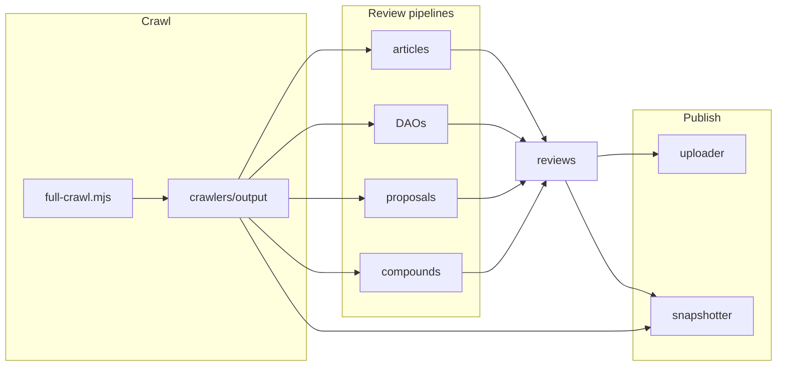

# Agent Core

Multi-route research review factory for DeScAI. Agent Core crawls source data (ResearchHub, Molecule IPNFTs, Pump Science compounds), runs LLM pipelines to produce scored reviews with evidence audits, optionally publishes bundles to Arweave, and snapshots crawl + review artifacts to private Cloudflare R2.

The top-level driver is [`orchestrate.py`](orchestrate.py): crawl → review every item → upload each bundle (auto-marks `reviewed` in crawl-log) → upload crawl-log every 5 reviews → snapshot.

## Architecture



## Prerequisites

- **Python 3.10+**
- **Node.js** (crawlers and Arweave uploader)
- **Local vLLM** or other OpenAI-compatible endpoints — see [`env-example.txt`](env-example.txt)
- **Optional:** Arweave wallet (`AGENT_WALLET`, `PATH_TO_KEYFILE`) for on-chain upload; Cloudflare R2 credentials for snapshots; Cloudflare D1 credentials for container status relay

## Setup

From the repository root:

```bash
python -m venv Agent && source Agent/bin/activate
pip install -r requirements.txt
cp env-example.txt .env   # edit LLM URLs, keys, optional R2/Arweave

cd uploader && npm install
cd ../crawlers/molecule/crawler && npm install   # if running Molecule crawl
```

## Quick start — orchestrator

[`orchestrate.py`](orchestrate.py) is the primary entry point for end-to-end runs.

| Command | Behavior |
|---------|----------|
| `python orchestrate.py` | Full run: crawl → all reviews → upload each → R2 snapshot |
| `python orchestrate.py --test` | Up to 10 reviews across routes (smoke test; `--test-limit N`) |
| `python orchestrate.py --dry-run` | Print commands only |
| `python orchestrate.py --skip-crawl` | Use existing `crawlers/output/` |
| `python orchestrate.py --skip-upload` | Pipelines only |
| `python orchestrate.py --skip-snapshot` | Skip R2 snapshot |
| `python orchestrate.py --just-snapshot` | Snapshot only |
| `python orchestrate.py --no-vis` | Dev: skip vision/LLM in pipelines |

**Data locations**

- Crawl output: `crawlers/output/`
- Review output: `reviews/{articles,DAOs,proposals,compounds}/`

## Review routes

| Route | Entry script | Crawl input | Output |
|-------|-------------|-------------|--------|
| [Articles](articles/README.md) | [`articles/pipeline/run_full_pipeline.py`](articles/pipeline/run_full_pipeline.py) | PDF URL or local PDF | `reviews/articles/<stem>/` |
| [DAOs](DAOs/molecule/README.md) | [`DAOs/molecule/pipeline/run_dao_review.py`](DAOs/molecule/pipeline/run_dao_review.py) | `crawlers/output/molecule/ipnfts/<SYMBOL>` | `reviews/DAOs/<SYMBOL>/` |
| [Proposals](proposals/README.md) | [`proposals/pipeline/proposal_pipe.py`](proposals/pipeline/proposal_pipe.py) | `crawlers/output/researchhub/proposals/proposal_*.json` | `reviews/proposals/proposal_<id>/` |
| [Compounds](compounds/README.md) | [`compounds/pipeline/single/run_review.py`](compounds/pipeline/single/run_review.py) or [`compounds/orchestrate.py`](compounds/orchestrate.py) | Local token manifest (see compounds README) | `reviews/compounds/<TICKER>/` |

### Per-route examples

**Article** — PDF URL through claim extraction, routing, and evidence grading:

```bash
python articles/pipeline/run_full_pipeline.py https://example.com/paper.pdf
```

**DAO** — single IPNFT from Molecule crawl:

```bash
python DAOs/molecule/pipeline/run_dao_review.py \
  --ipnft-dir crawlers/output/molecule/ipnfts/BeeARD
```

**Proposal** — ResearchHub funding proposal JSON:

```bash
python proposals/pipeline/proposal_pipe.py \
  --input-json crawlers/output/researchhub/proposals/proposal_4459.json \
  --output-dir reviews/proposals/proposal_4459
```

**Compound** — single Pump Science token:

```bash
python compounds/pipeline/single/run_review.py --compound Rh2
```

Multi-compound bundles:

```bash
python compounds/orchestrate.py --compounds Omipalisib Ginsenoside_Rh2 Urolithin_A
```

## Directory map

| Path | Purpose |
|------|---------|
| [`articles/`](articles/) | Research-paper review pipeline + prompts |
| [`compounds/`](compounds/) | Pump Science compound screening pipeline |
| [`DAOs/`](DAOs/) | Molecule Research DAO review pipeline |
| [`proposals/`](proposals/) | ResearchHub funding-proposal reviews |
| [`crawlers/`](crawlers/) | Ingestion — [`full-crawl.mjs`](crawlers/full-crawl.mjs) writes to `crawlers/output/` |
| [`reviews/`](reviews/) | Generated review bundles (gitignored) |
| [`uploader/`](uploader/) | Arweave upload recipes |
| [`snapshotter/`](snapshotter/) | Compress + upload backup to R2 |
| [`orchestrate.py`](orchestrate.py) | Top-level agent driver |
| [`status_relay.py`](status_relay.py) | Container-side orchestrator status monitor (writes to D1) |
| [`monitor/schema.sql`](monitor/schema.sql) | D1 tables for orchestrator run status |

**Gitignored local data:** `reviews/`, `crawlers/output/*`, `old/`, `snapshot.tar.zst`, `snapshot-receipt.json`.

## Output layout

Every pipeline run produces a consistent bundle under its output root:

```text
reviews/<route>/<id>/
├── review/
│   ├── review.json          # scored review (integer 0–100 scores)
│   ├── overview.json        # plain-language summary
│   └── evidence_audit.md    # provenance audit trail
└── steps/                   # intermediate artifacts (per pipeline)
```

## Configuration

Copy [`env-example.txt`](env-example.txt) to `.env` at the repo root. Shared LLM config lives in [`articles/llm_env.py`](articles/llm_env.py) (re-used by proposals and compounds).

| Variable group | Key variables | Used by |
|----------------|---------------|---------|
| Review LLM | `LLM_BASE_URL`, `LLM_API_KEY`, `LLM_MODEL` | All pipelines |
| Tagger LLM | `TAGGER_BASE_URL`, `TAGGER_API_KEY`, `TAGGER_MODEL` | Claim/proposal tagging |
| Vision / OCR | `VISION_MODEL_URL`, `VISION_MODEL_API_KEY`, `READ_PAPER_MODEL` | PDF read, DAO multimedia |
| Literature | `OPENALEX_EMAIL` | Originality / scientific grounding |
| Hugging Face Hub | `HF_TOKEN` | `hf` CLI, `transformers`, Docling `BAAI/bge-m3` downloads |
| Arweave | `AGENT_WALLET`, `PATH_TO_KEYFILE` | [`uploader/`](uploader/README.md) |
| R2 snapshot | `SNAPSHOT_R2_ENDPOINT`, `SNAPSHOT_R2_BUCKET`, `SNAPSHOT_R2_ACCESS_KEY_ID`, `SNAPSHOT_R2_SECRET_ACCESS_KEY` | [`snapshotter/`](snapshotter/README.md) |
| D1 status relay | `D1_DATABASE_ID`, `D1_ACCOUNT_ID`, `D1_TOKEN` | Docker entrypoint → [`status_relay.py`](status_relay.py) |

Optional overrides: `VALIDATOR_MODEL`, `CLASSIFIER_MODEL`, `LLM_ENABLE_THINKING`. Deprecated aliases `VLLM_*` still work when `LLM_*` is unset.

## Publishing

**Arweave** — from repo root after `cd uploader && npm install`:

```bash
python -m uploader --recipe article  --dir reviews/articles/<stem>/review [--resume]
python -m uploader --recipe proposal --dir reviews/proposals/proposal_<id>/review [--resume]
python -m uploader --recipe dao      --dir reviews/DAOs/<SYMBOL>/review [--resume]
python -m uploader --recipe compounds --dir reviews/compounds/<TICKER>/review [--resume]
python -m uploader --recipe crawl-log --file crawlers/output/crawl-log.json
```

Review uploads auto-mark `reviewed` in `crawlers/output/crawl-log.json` (v2). See [`uploader/README.md`](uploader/README.md) for recipe details and resume behavior.

**R2 backup:**

```bash
python -m snapshotter              # build snapshot.tar.zst + upload
python -m snapshotter --dry-run      # list contents only
python -m snapshotter --no-upload    # build archive locally
```

See [`snapshotter/README.md`](snapshotter/README.md) for R2 setup and flags.

## Container status relay

When the image starts via [`entrypoint.sh`](entrypoint.sh), a background [`status_relay.py`](status_relay.py) process tails `logs/orchestrate.log` and writes orchestrator phase to the Cloudflare D1 database **`agent-status`**. It does not modify or signal the orchestrator.

| Status | Meaning |
|--------|---------|
| `crawling` | Step 1 (full crawl) in progress |
| `reviewing` | Review routes or snapshot step in progress |
| `done` | `orchestrate.py` exited 0 |
| `crashed` | `orchestrate.py` exited non-zero |

**D1 setup (once):** apply [`monitor/schema.sql`](monitor/schema.sql) to `agent-status` (dashboard or `wrangler d1 execute agent-status --remote`).

**Env vars** (in `.env` / `.env.age`):

| Variable | Purpose |
|----------|---------|
| `D1_DATABASE_ID` | D1 database UUID for `agent-status` |
| `D1_ACCOUNT_ID` | Cloudflare account ID |
| `D1_TOKEN` | API token with **D1 Edit** on that database |

Optional: `ORCHESTRATOR_RUN_ID` (default `{hostname}-{unix_ts}`), `STATUS_RELAY_ENABLED=0` to disable.

D1 writes are **best-effort** — if the API is unreachable, the relay logs a warning and the orchestrator keeps running. Include the D1 vars in encrypted `.env.age` for container runs.

## Further reading

- [Articles pipeline](articles/README.md) — 13-step claim extract → empirical evidence grading
- [Articles empirical stages](articles/pipeline/empirical/PIPELINE.md) — triage, citation compare, originality, scoring
- [Compounds pipeline](compounds/README.md) — discover, tag, topic groups, review
- [Compounds review logic](compounds/REVIEW_LOGIC.md) — scoring and synthesis details
- [DAO pipeline](DAOs/molecule/README.md) — IPNFT dataroom → six-category review
- [Proposals pipeline](proposals/README.md) — ResearchHub funding proposal review
- ResearchHub crawler: [crawlers/research-hub/README.md](../research-hub/README.md)
- Molecule crawler: [crawlers/molecule/crawler/README.md](../crawlers/molecule/crawler/README.md)
- Crawlers overview: [crawlers/README.md](../crawlers/README.md)
- [Uploader](uploader/README.md) — Arweave recipes and wallet setup
- [Snapshotter](snapshotter/README.md) — R2 backup of crawl + review artifacts
